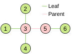
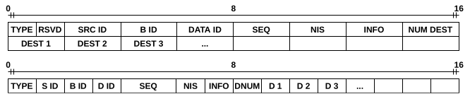
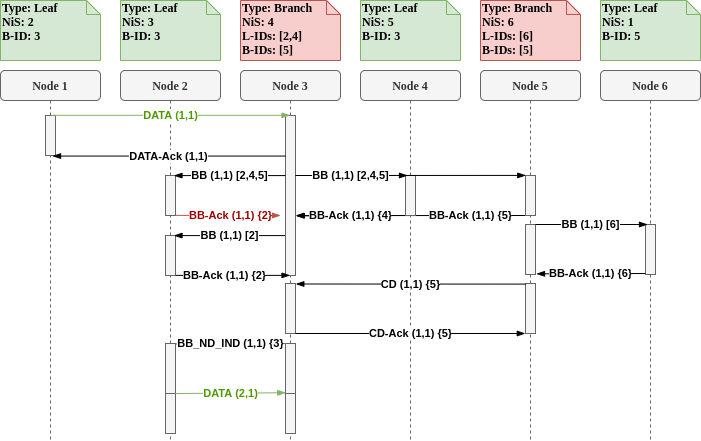

Any references to this code, protocol, or results shall be realized by citing the original paper: $DOI. 

## **Preface**
This is the complementary code repository for the scientific publication "Minimizing Age of Information for Distributed Control in Smart Grids" by Fisser, Leonard and Timm-Giel, Andreas published at the IEEE International Conference on Communications, Control, and Computing Technologies for Smart Grids 2021 held in Aachen.

The provided codebase includes every necessary code to reproduce the results presented in the paper.
While all presented code is made available for public use under GNU GPLv2.0, portions of the code use external software libraries.
External code which is embedded in this repository is compatible with the selected licensing.
Additional dependencies may have to be acquired to fully use the provided toolchain (for example a working NS-3 installation as well as Gurobi).
The authors are aware that these dependencies do not completely fulfill the requirements for open-source code publications, but the trade-off has been made to achieve significant performance gains.
Optional replacements for proprietary libraries (such as Gurobi) are included where applicable.  

As the complete toolchain is quite large and covers different programming language, possible reuse of published code will be difficult.
However, in the hope that at least parts of the toolchain can be reused by other researchers, the code is structured into four parts.
Each part can theoretically be used on its own and may only partially depend on its previous step.

The code is provided as is and does not claim to be part of any workshop or demo.
Support is not guaranteed, but feel free to contact the corresponding author with any question regarding the code or protocol.

## **Toolchain Overview**
### **01_Pre-Processing**
In the first part, topology generation, MCDS calculation and simulation-data generation are conducted.
The output of the first pre-processing script is a set of separated LVDGs.
The whole pre-processing setup is further divided into 3 sup tasks accessible by the main scripts.
In general, no changes have to be made to any files except the mains scripts. 
- **a_osm_processing**  
In this script, an OpenStreetMap data export is used to create a configurable amount of Low Voltage Distribution Grids (LVDGs) using the methodology presented in the paper.
Besides path configurations, the following parameters have to be specified:
  - street_fix_distance: The maximum distance between two street anchor points for them to be considered connected (default: 0.001km).
  - mean_num_loads: The average number of households connected to a MV/LV substation (default: 101 urban, 87 sub-urban, 51 rural).   
  - Furthermore, the optimization options for the k-medoid clustering method have to be specified.  

- **b1_mcds_processing / b2_mcds_processing**  
The Minimum Connceted Dominating Set (MCDS) formulation is split into two steps due to unfavorable computational performance.
In b1_mcds_processing, the optimization problem is formulated as an Linear Program, whereas b2_mcds_processing actually solves the problem.
This split was introduced to allow a restart of MATLAB between both calculation steps, allowing for a re-allocation of RAM.
Besides path configurations, the following parameters have to be specified:
  - use_lp: Either use the Gurobi LP MCDS solver, or use an unperformant exhaustive search algorithm.
  - start_communiation_range: The minimum node communication range used in creating the logical communication graph.
  - communication_range_increments: As we need a fully connected graph for the flooding algorithm presented in this paper, the communication range is incremented until each node is connected.

- **c_conc_seq_flooding_processing**  
In the last pre-processing step, all required node-control information for the full network simulation are generated and exported to separate folders.
It has to be noted, that this step generates a high number of small files.
Besides path configurations, no parameters have to be specified.

### **02_Simulator**
The files provided in the second step include the actual implementation of the flooding protocol and simulation setup scripts.
As the source code for NS-3 is [publicly available](https://www.nsnam.org/), only a software patch to be copied into the simulators main directory is included in this repository.
The publication was based on the modified NS-3 codebase available [here](https://github.com/usnistgov/psc-ns3/tree/v3.0.1)
The patch includes the required application files, simulation setup files and batch run scripts.
For the actual execution of the simulations please refer to the scripts:
- run_sg_flooding_high
- run_sg_flooding_large_high
- run_sg_flooding_large_low
- run_sg_flooding_low
- run_sg_flooding_matrix
Each of these files corresponds to one evaluation conducted for the published paper.

It has to be noted that both simulation scripts include an option to switch between 802.11 and LTE-D2D communication protocols.
However, as only the CMSA-CA based technology was investigated in depth for the publication, no guarantees on the LTE-D2D implementation are given.
It is just left in the code, as it was present during the simulation campaign for the paper and in the hope that it might be of interest for other researchers.

### **03_Result-Processing**
As the trace output of the simulation is quite convoluted and does not provide all important KPIs directly, a result processing step has to be executed.
Theoretically, no configuration of this code should be necessary and it is only provided to explicitly show how each metric was calculated.
The processing script should be ideally executed directly after the simulation finishes.
For doing this please, refer to the command   
`matlab20b -nodisplay -nosplash -nodesktop -r "cd ../../03_Result-Processing; addpath(genpath(pwd));d_result_processing(\"$outputDir\",\"$outputDirProcessed\",\"$experimentName\",$doCalcPeak); exit;" | tail -n +11 > $saveName/processingLog.txt &
`  
in the `run_sg_flooding_*` scripts.

### **04_Plots**
The plotting suite uses the post-processed results from step 3 and includes all plots presented in the paper.
To allow for a more interactive plotting experience, a MATLAB live script `e_plotter.mlx` is provided.

### **05_Sim-Data**
As some toolchain steps either take a long time to compute (matrix simulations - +2 Weeks on a moderately equipped server) or use licensed software, output files are provided.
These files are identical to the ones used for plotting the results of the paper and should enable everyone to simply execute each toolchain step individually.
Please refer to the actual toolchain steps for naming conventions, as some path adjustments might be necessary to access this sim-data directory.

## **Installation**
Please install and make sure the following dependencies are available:
  - [PSC-NS3 V3.0.1](https://github.com/usnistgov/psc-ns3/tree/v3.0.1)
  - [MATLAB20b](https://de.mathworks.com/products/matlab.html)
  - [Gurobi for MATLAB](https://www.gurobi.com/documentation/9.1/quickstart_mac/matlab_setting_up_grb_for_.html)
  - NS-3 Patch (this code)
A working simulation can be achieved without MATLAB and Gurobi by using the supplied pre-processing files found in 05_Sim-Data.

Simulations should be started by using any of the `run_sg_flooding_*` bash scripts located in the ns3-patch folder.
These bash files automatically start the evaluations conducted in the paper and are configured by some static variables at the start of each script.

In any case, please make sure you set up each script with correct options and path variables. If scripts fail, it is most likely because of misconfigured paths or missing input data.

## **Protocol Overview**
The flooding protocol evaluated in the corresponding paper is based off the commonly known `Sequential Flooding` Protocol.
It is extended by using a Minimum Connected Dominating Set of nodes as Virtual Backbone Network.
Furthermore, the sequential nature can be softened by increasing the number of simultaneously occurring flooding processes.
For some mode details please consult the following Message Sequence Chart, Header Map, the paper, or the implementation itself.

#### **Minimum Connected Dominating Set**
As described MCDSs are used as Virtual Backbone Networks for disseminating the data chunks efficiently through the network.
A simple semantic view of such a backbone network is given in the following figure.    

  
**Fig. 1 : Simple Minimum Connected Dominating Set** 

#### **Protocol Header Map**
In the following figure the header fields used by the PSAA flooding protocol are given.
Depending on the field size (unit8 vs uint32), a short of long version of the header can be used.

  
**Fig. 2 : Protocol Header Map** 

A short description of each field's purpose is given:
- TYPE: The control/data format of the corresponding transmission.
- SRC ID: The unique node ID from which the transmission originated.
- B ID: Blocked-ID, a node ID to which this transmission shall not be forwarded (breaks 2-hop network cycles).
- DATA ID: The unique node ID from which the data chunk originated.
- SEQ: The sequence number of the data chunk.
- NIS: The node ID which is the next in the stream of nodes corresponding to this data chunk.
- INFO: Multi-purpose field, mainly used to indicate nodes covered by aggregated ACKs.
- NUM-DEST: The number of multicast destinations.
- DEST *: The unique node ID of each destination.

#### **Message Sequence Chart**
This MSC depicts a typical dissemination process of data chunk (1,1) representing the data chunk originating from node 1 and with a sequence number of 1.
The 6 node network previously depicted in the MCDS section is re-used.
After successful delivery of the `NewData` transmission to the parent of node 1, the data is broadcasted to all children of the backbone node 3, as well as forwarded to the next backbone node 5.
After the data chunk is delivered to all nodes, and the parent node of the node which is next in stream (the parent of node 2 (next in stream) is node 3) received all aggregated ACK's, the dissemination of packet (2,1) starts.
It should be highlighted that a retransmission occurs as the ACK from node 2 is not successfully received by node 3.
In the subsequent retransmission, the already ACK'ed node 4 is removed from the destination field array. 

  
**Fig. 3 : Exemplary Message Sequence Chart** 

